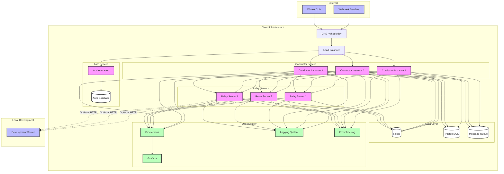

# Proposed Architecture

## Component Overview

### External Layer

- **Webhook Senders**: External services (GitHub, Stripe, Chargebee, etc) that send webhooks to `whook`
- **whook CLI**: Command-line interfaces running on developers' machines that display webhooks and optionally forward them to local development servers

### Cloud Infrastructure

#### DNS Layer

- Handles routing of all \*.whook.dev domains to the appropriate services
- Ensures webhook requests reach the correct project endpoints

#### Load Balancer

- Distributes incoming traffic across multiple conductor instances
- Provides the first layer of reliability and scaling

#### Auth Service

- Manages user authentication and project ownership
- Maintains its own database for auth-specific data

#### Conductor Service

- Multiple instances for high availability
- Coordinates tunnel assignments between clients and relay servers
- Manages project configurations and routing logic

#### Relay servers

- Handles WebSocket connections from whook CLIs
- Forward incoming webhooks to connected clients
- Scale independently based on connection load

#### Data Layer

- **Redis**: Fast in-memory storage, contains relay servers with latest heartbeat and current load
- **PostgreSQL**: Persistent storage for project data and configuration
- **Message Queue**: Handles async operations and request buffering

#### Observability

- **Prometheus/Grafana**: Metrics collection and visualisation
- **Logging System**: Centralised log aggregation (logstash?)
- **Error Tracking**: Real-time error monitoring and reporting (sentry, but something self hosted?)

### Local Development

- Optional connection to local development server
- Enables testing webhooks against local environments while still having observability over the body of the request, optionally it could also log the response from the local development server and act as a complete HTTP proxy
