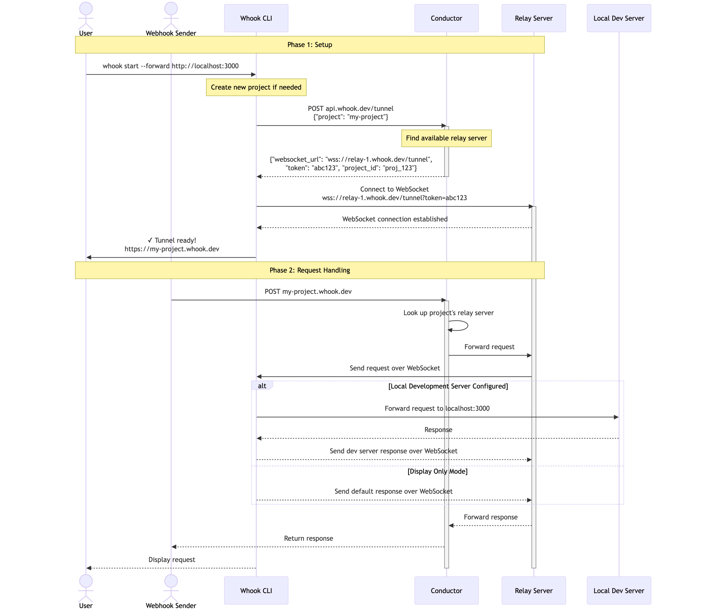

# Request Flow

## Sequence Diagram



### Phase 1: Initial Setup

1. User starts whook CLI
2. CLI requests a tunnel from the conductor:

```
POST api.whook.dev/tunnel
{"project": "my-project"}
```

3. Conductor assigns a relay server and returns connection details

```json
{
  "websocket_url": "wss://relay-1.whook.dev/tunnel",
  "token": "abcd123",
  "project_id": "my-project"
}
```

4. CLI establishes WebSocket connection with the assigned relay server
5. System is ready to receive webhooks

### Phase 2: Webhook Handling

1. External service sends webhook to `my-project.whook.dev`
2. Request flows through system:
   - Conductor recevies request and identfiies appropriate relay server
   - Relay server forwards request through established WebSocket
   - CLI recevies webhook data and:
     - Displays it in the terminal interface
     - Optionally forwards it to a local development server
3. Response flows back through the same path to the original sender
